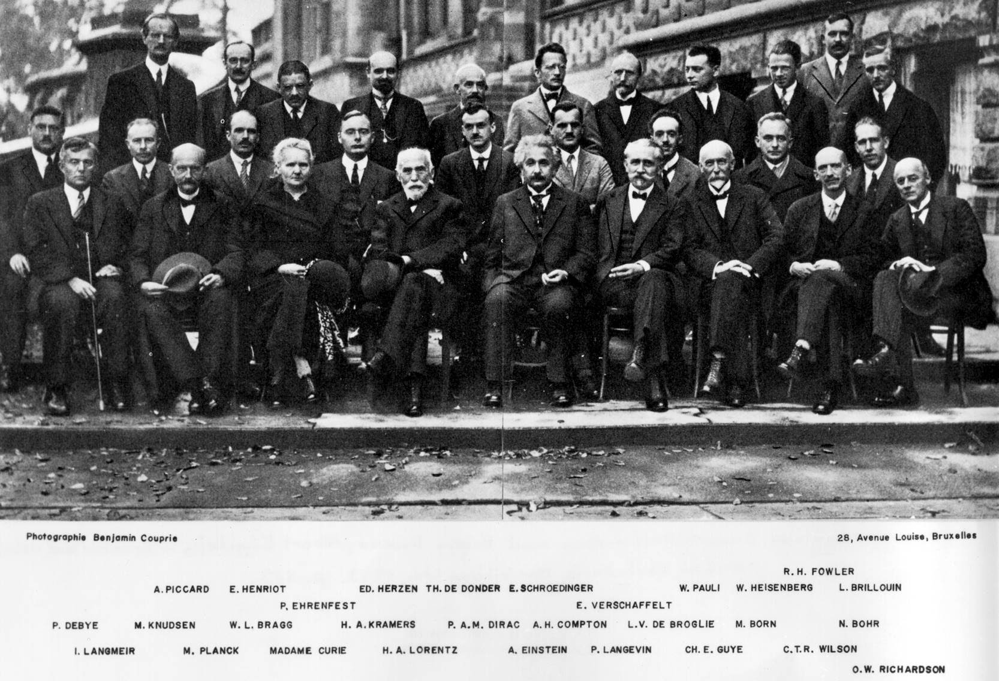
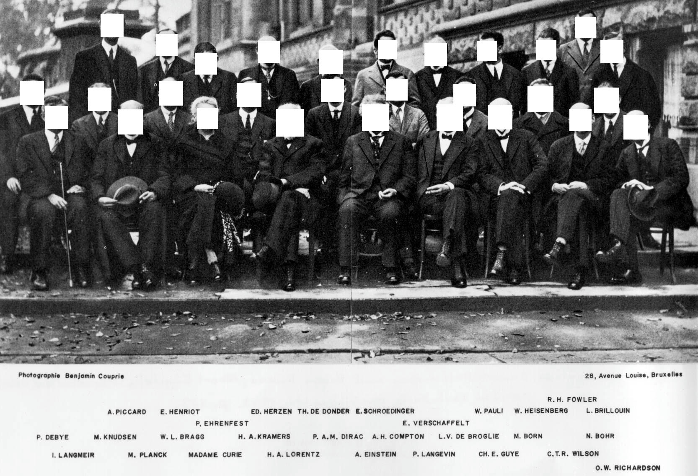

# delete_face





> Delete face from entered image

- **[SEETAFACE C++](https://github.com/seetaface/SeetaFaceEngine/tree/master/FaceDetection)**
- **[RustFace](https://github.com/atomashpolskiy/rustface)**

## use

Make 'input' directory and put the picture you want in the 'input' folder.

if you enter the "test2", set the image path to "input/test2/" and create the "output/test2/" folder to save edited photos.

```bash
$ cargo build --release && ./target/release/delete_face


Input image path: test

------------------------------------------

image path is: input/test

------------------------------------------
image count: 7

 [████████████████████] | 7/7 | 100.00% | output/test/example.jpg

------------------------------------------
Done!
```

## example file tree

```text
delete_face/
├── src/
│   └── main.rs
├── input/
│   └── test2/
│       ├── test1.jpg
│       ├── test2.png
│       └── test3.jpeg
├── output/
│   └── test2/
│       ├── test1.jpg
│       ├── test2.png
│       └── test3.jpeg
├── model/
│   └── seeta_fd_frontal_v1.0.bin
├── Cargo.toml
├── Cargo.lock
└── target/
    ├── debug
    └── release/
        └── delete_face
```
